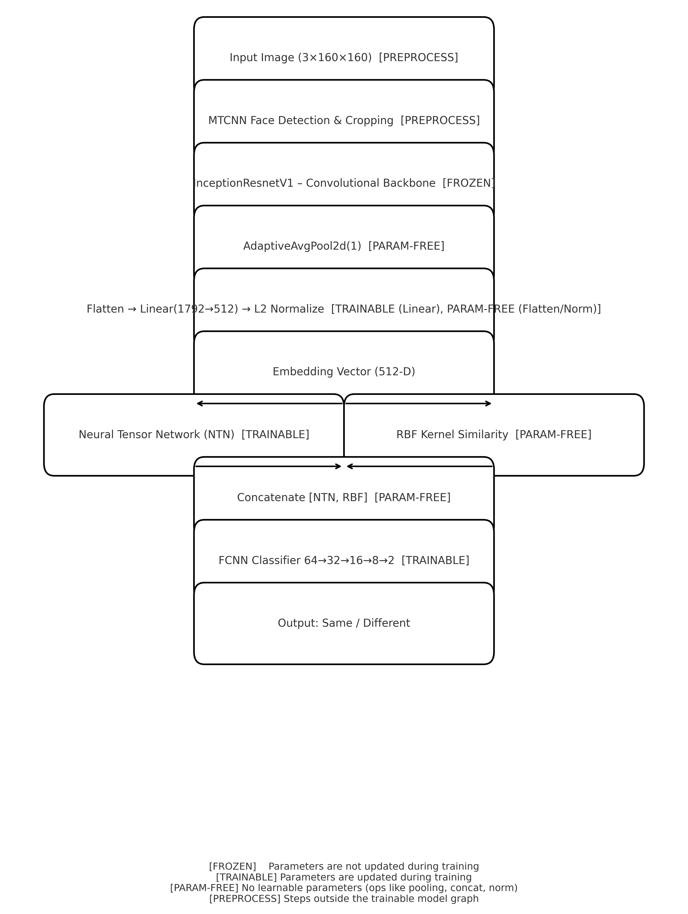

# Face Recognition Hackathon Notebook

This repository contains the notebook `hackathon_face_rekog.ipynb` for a face recognition pipeline built using **PyTorch**, **Facenet**, and **MTCNN**. The project was developed during a 7-day AI Hackathon in association with EarlySalary, where it achieved **First Runner-Up** position.

## Overview

The notebook implements an end-to-end face recognition workflow:
- **Face Detection & Preprocessing**: Uses **MTCNN** to detect, crop, and align faces before embedding generation.  
- **Model Architecture**:
  - **Backbone**: Pretrained **InceptionResnetV1 (FaceNet, VGGFace2 weights)** as a frozen feature extractor.  
  - **Embedding Head**: Adaptive Average Pooling → Flatten → Linear (1792→512) → L2 Normalization.  
  - **Pair Interaction**: Neural Tensor Network (NTN) to capture higher-order interactions between embeddings.  
  - **Extra Similarity Feature**: Radial Basis Function (RBF) kernel on embedding differences.  
  - **Classifier**: Multi-layer fully connected network mapping NTN+RBF features to {same, different}.  

  

**Performance**:  
- Training Accuracy: **93.6%**  
- Test Accuracy: **92.9%**

## Getting Started

- Open the notebook `hackathon_face_rekog.ipynb` directly on GitHub or in Colab.  
- The notebook expects:
  - Dataset structured as `ES_FaceMatch_Dataset` with `train.csv`, `test.csv`, and `dataset_images/`.  
  - A pretrained model file path provided via `PATH_TO_MODEL`.

## Notes

- Outputs are intentionally preserved in the notebook for reproducibility.  
- Large datasets and generated artifacts are excluded via `.gitignore`.  

## License

This project is licensed under the MIT License. See the [LICENSE](LICENSE) file for details.
